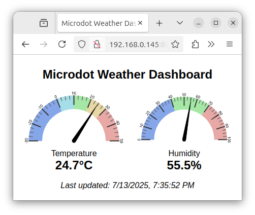

# Microdot Weather Dashboard

This example reports the temperature and humidity, both as a web application
and as a JSON API.



## Requirements

- A microcontroller that supports MicroPython (e.g. ESP8266, ESP32, Raspberry
  Pi Pico W, etc.)
- A DHT22 temperature and humidity sensor
- A breadboard and some jumper wires to create the circuit

## Circuit

Install the microconller and the DHT22 sensor on different parts of the
breadboard. Make the following connections with jumper wires:

- from a microcontroller power pin (3.3V or 5V) to the left pin of the DHT22
  sensor. 
- from a microcontroller `GND` pin to the right pin of the DHT22 sensor.
- from any available microcontroller GPIO pin to the middle pin of the DHT22
  sensor. If the DHT22 sensor has 4 pins instead of 3, use the one on the left,
  next to the pin receiving power.

The following diagram shows a possible wiring for this circuit using an ESP8266
microcontroller and the 4-pin variant of the DHT22. In this diagram the data
pin of the DHT22 sensor is connected to pin `D2` of the ESP8266, which is
assigned to GPIO #4. Note that the location of the pins in the microcontroller
board will vary depending on which microcontroller you use.


## Installation

Edit *config.py* as follows:

- Set the `DHT22_PIN` variable to the GPIO pin number connected to the sensor's
  data pin. Make sure you consult the documentation for your microcontroller to
  learn what number you should use for your chosen GPIO pin. In the example
  diagram above, the value should be 4.
- Enter your Wi-Fi SSID name and password in this file.

Install MicroPython on your microcontroller board following instructions on the
MicroPython website. Then use a tool such as
[rshell](https://github.com/dhylands/rshell) to upload the following files to
the board:

- *main.py*
- *config.py*
- *index.html*
- *microdot.py*

You can find *microdot.py* in the *src/microdot* directory of this repository.

If you are using a low end microcontroller such as the ESP8266, it is quite
possible that the *microdot.py* file will fail to compile due to the
MicroPython compiler needing more RAM than available in the device. In that
case, you can install the `mpy-cross` Python package in your computer (same
version as your MicroPython firmware) and precompile this file. The precompiled
file will have the name *microdot.mpy*. Upload this file and remove
*microdot.py* from the device.

When the device is restarted after the files were uploaded, it will connect to
Wi-Fi and then start a web server on port 8000. One way to find out which IP
address was assigned to your device is to check your Wi-Fi's router
administration panel. Another option is to connect to the MicroPython REPL with
`rshell` or any other tool that you like, and then press Ctrl-D at the
MicroPython prompt to soft boot the device. The IP address is printed to the
terminal on startup.

You should not upload other *.py* files that exist in this directory to your
device. These files are used when running with emulated hardware.

## Trying out the application

Once the device is running the server, you can connect to it using a web
browser. For example, if your device's Wi-Fi connection was assigned the IP
address 192.168.0.145, type *http://192.168.0.45:8000/* in your browser's
address bar. Note it is *http://* and not *https://*. This example does not use
the TLS/SSL protocol.

To test the JSON API, you can use `curl` or your favorite HTTP client. The API
endpoint uses the */api* path, with the same URL as the main website. Here is
an example using `curl`:

```bash
$ curl http://192.168.0.145:8000/api
{"temperature": 21.6, "humidity": 58.9, "time": 1752444652}
```

The `temperature` value is given in degrees Celsius. The `humidity` value is
given as a percentage. The `time` value is a UNIX timestamp.

## Running in Emulation mode

You can run this application on your computer, directly from this directory.
When used in this way, the DHT22 hardware is emulated, and the temperature and
humidity values are randomly generated.

The only dependency that is needed for this application to run in emulation
mode is `microdot`, so make sure that is installed, or else add a copy of the
*microdot.py* from the *src/microdot* directory in this folder.
